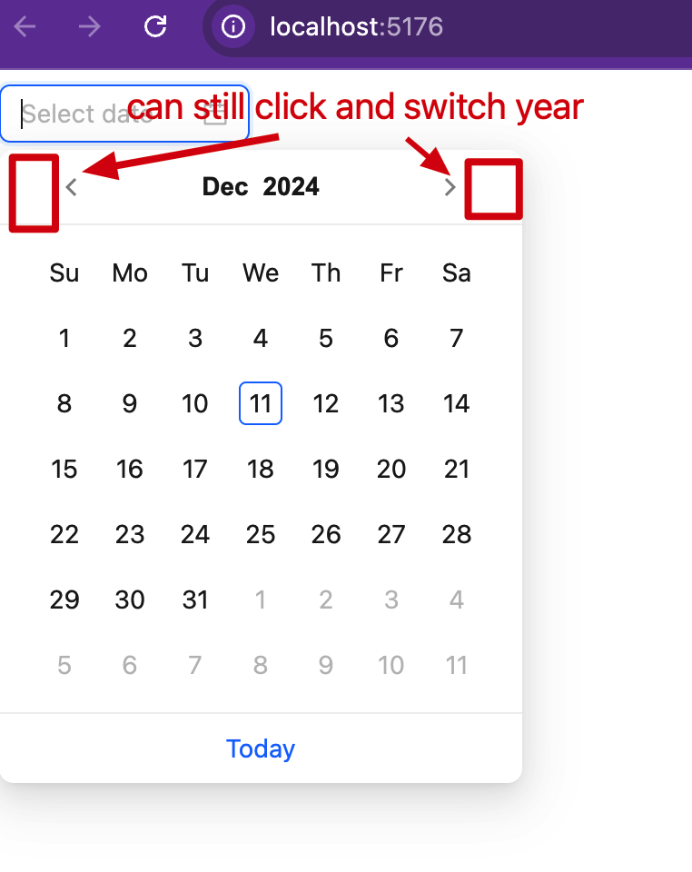

TypeScript React AntDesign Disable Year Switching Issue Demo
=================================

给DatePicker组件设置了

```
superPrevIcon={null}
superNextIcon={null}
```

虽然年份切换的图标没有了，但是其空白按钮仍然可以点击，导致年份切换。



NOTE: 为什么我想禁用年份切换？因为给客户做了timesheet应用，客户经常误点，填到下一年。这个设计不太直观。


```
npm install
npm start
```

It will open page on browser automatically.
